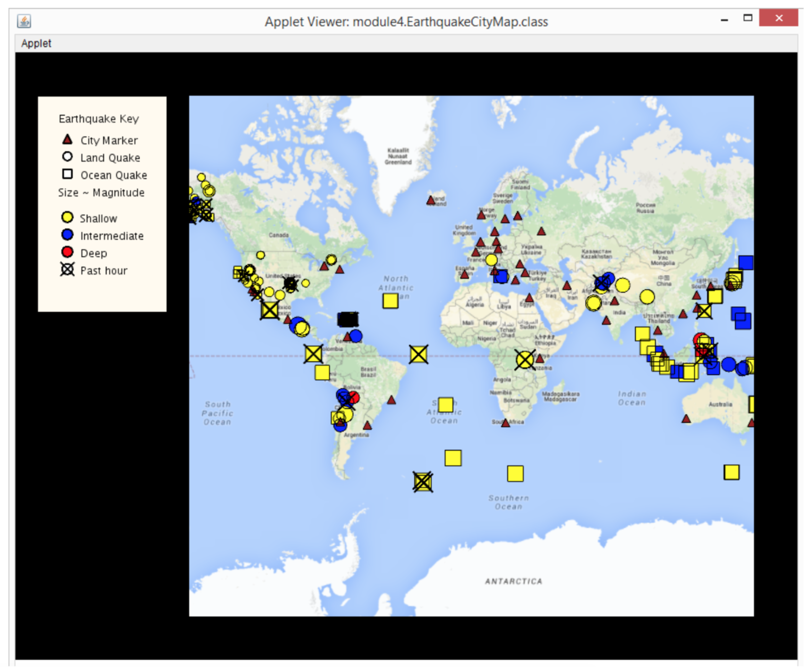

# UnfoldingMap in Java
This repo is used to document all my work on projects in OOP in Java, provided by UCSD on Coursera. The course name is "Object Oriented Programming in Java".
The course link can be found here: https://www.coursera.org/learn/object-oriented-java/

# High Level Description
This project is an interative GUI module using Processing https://processing.org/ and UnfoldingMap http://unfoldingmaps.org/.
The function is to display a world map with live Earthquake data feed from  http://earthquake.usgs.gov/.
Also it is required to show markers for earthquakes and major cities in the world. Sorting algorithms are applied to sort earthquake based on different level of magnitude.

# Features

Different size of markers will be displayed on the map based on the type of the earthquake. Different colors also indicate the magnitude of the earthquakes. Legends on the side also indicate extra information on the map.
